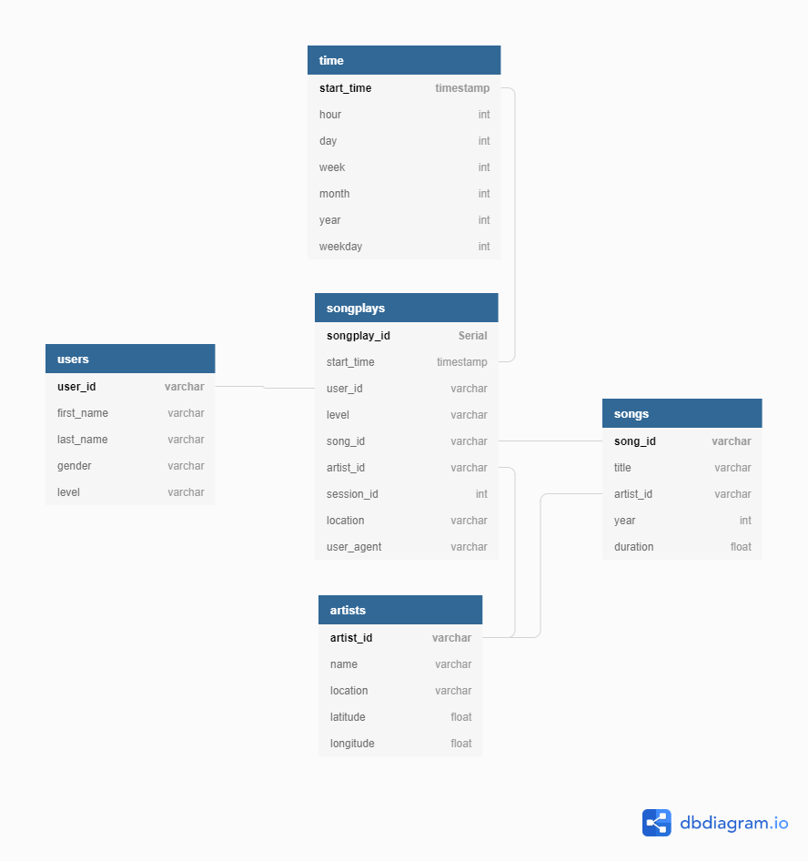

# 1. Data Modeling with PostgresSQL

#### #PostgresSQL, #Python, #Psycopg2
In this first project the following concepts and techniques are put into practice:

- Data modeling using PostgresSQL
- Definition of fact and dimension tables in a star schema
- Building of an ETL pipeline using Python.

## Motivation 
A startup called Sparkify wants to analyze the data they've been collecting on songs and user activity on their new music streaming app. The analytics team is particularly interested in understanding what songs users are listening to. Currently, they don't have an easy way to query their data, which resides in a directory of JSON logs on user activity on the app, as well as a directory with JSON metadata on the songs in their app.

Hence, the goal of this project is design a database optimized for songplay analyis and to set up an ETL pipeline to process the seperate datasets.

## Database Schema
In order to achieve this, the sparkifydb is set up in a star schema with the following tables:
#### Fact Table:
- **songplays** - containing all the relevant log_data for songplay analysis i.e. records in log data with page NextSong
#### Dimension Tables:
- **users** - users in the app
- user_id, first_name, last_name, gender, level
- **songs** - songs in music database, song_id, title, artist_id, year, duration
- **artists** - artists in music database
artist_id, name, location, latitude, longitude
- **time** - timestamps of records in songplays broken down into specific units: start_time, hour, day, week, month, year, weekday

**Benefits of using this schema are that it allows us to formulate...**
- **Simple queries  (e.g. Joins),** and to do
- **Fast aggregation for analyis.**

**It is therefore well suited for the OLAP type of workloads the Sparkify team seeks out to do.**

## ETL pipeline
To transfer data from the song- and log files to the DB do the following:

1. **Run the `create_tables.py` script** -  this will create new tables and drop existing ones.
2. **Run `etl.py`** -which will iterate over all song- and log-data files and insert them in your sparkifydb using the star schema described above.

To test if everything has worked and the data has been inserted into the database the Jupyter-Notebook `test.ipynb`c can be used.
